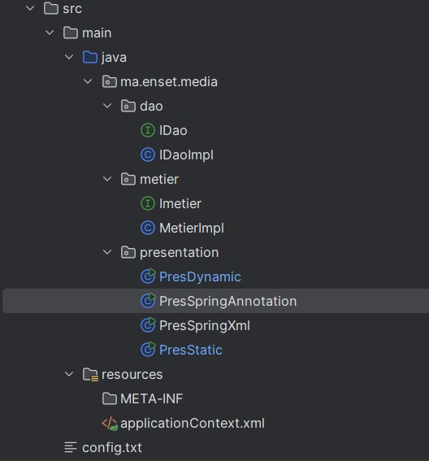
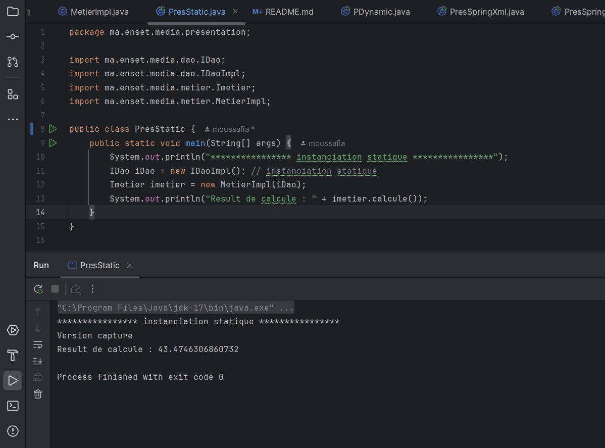
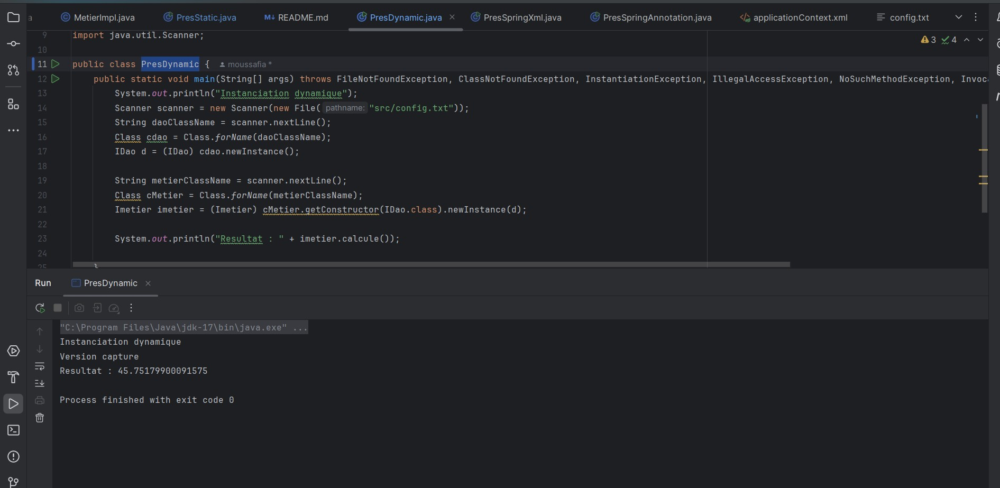
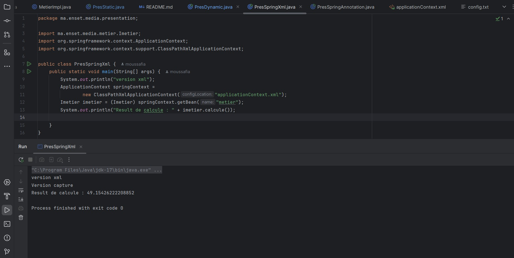

# dependency-injection

<h1>Introduction</h1>

Ce projet est une activité pratique visant à comprendre les différents types d'injection de dépendances, comme l'injection par instanciation dynamique ou statique. J'utilise également les dépendances de Spring pour réaliser l'injection de dépendances avec une configuration XML ou des annotations, afin de maîtriser les différents concepts de l'injection de dépendances.

<h2>architecture du projet</h2>

<h2>Injection des dépendances Par instanciation statique</h2>

<h2>Injection des dépendances Par instanciation dynamique</h2>

<h2>Injection des dépendances En utilisant le Framework Spring</h2>
<h3> - Version XML</h3>

<h3> - Version annotations</h3>

